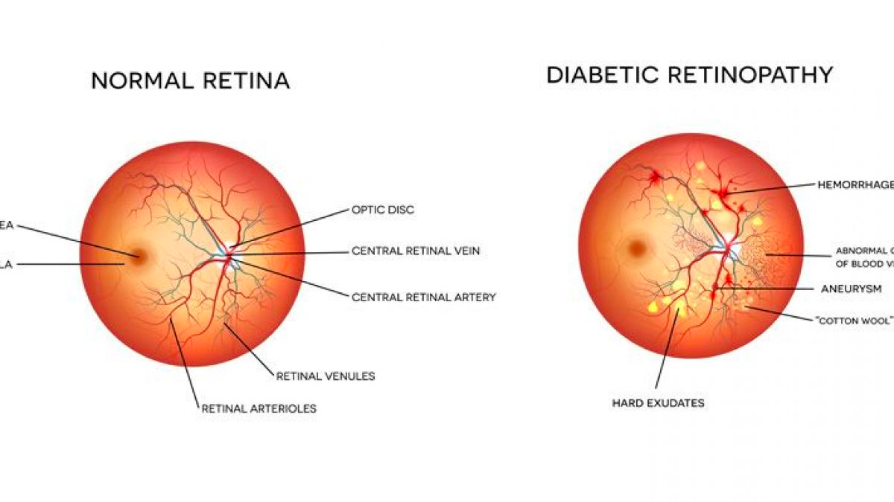

# Diabetic Retinopathy Detection Using Artificial Intelligence
Using Artificial Intelligence to detect Diabetic retinopathy - the leading cause of blindness in the working-age population of the developed world. It is estimated to affect over 93 million people.
 

## Objectives:

- Understand the theory and intuition behind Deep Neural Networks, Residual Nets, and Convolutional Neural Networks (CNNs).
- Apply Python libraries to import, pre-process and visualize images.
- Perform data augmentation to improve model generalization capability.
- Build a deep learning model based on Convolutional Neural Network and Residual blocks using Keras with Tensorflow 2.0 as a backend.
- Compile and fit Deep Learning model to training data.
- Assess the performance of trained CNN and ensure its generalization using various KPIs such as accuracy, precision and recall.

## Structure:

### Task #1: Understand the Problem Statement and Business Case

### Task #2: Import Libraries and Datasets

### Task #3: Perform Data Exploration and Visualization

### Task #4: Perform Data Augmentation and Create Data Generator

### Task #5: Understand the Theory and Intuition Behind Convolutional Neural Networks

### Task #6: Build a ResNet Deep Neural Network Model

### Task #7: Compile and Train the Deep Neural Network Model

### Task #8: Assess the Performance of the Trained Model