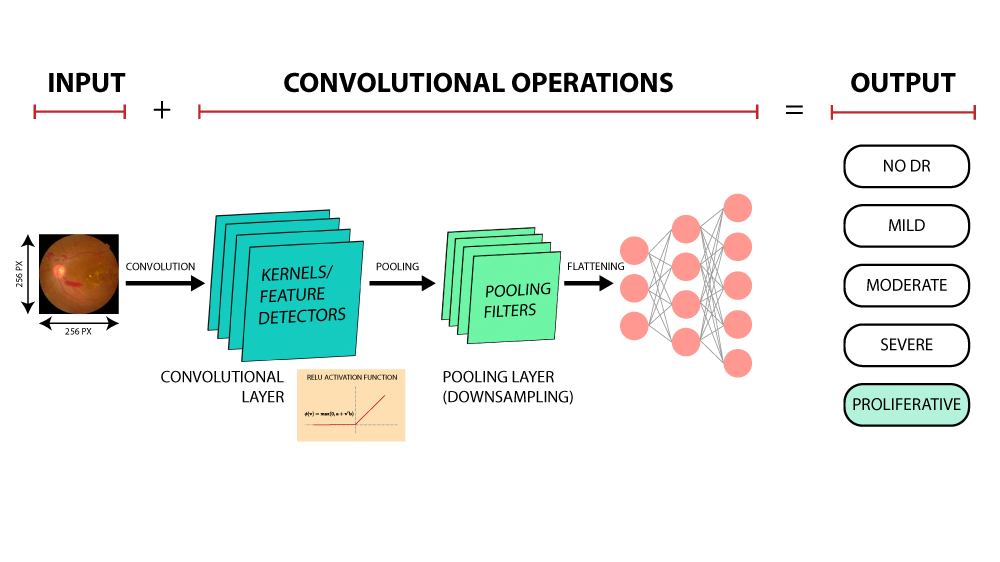
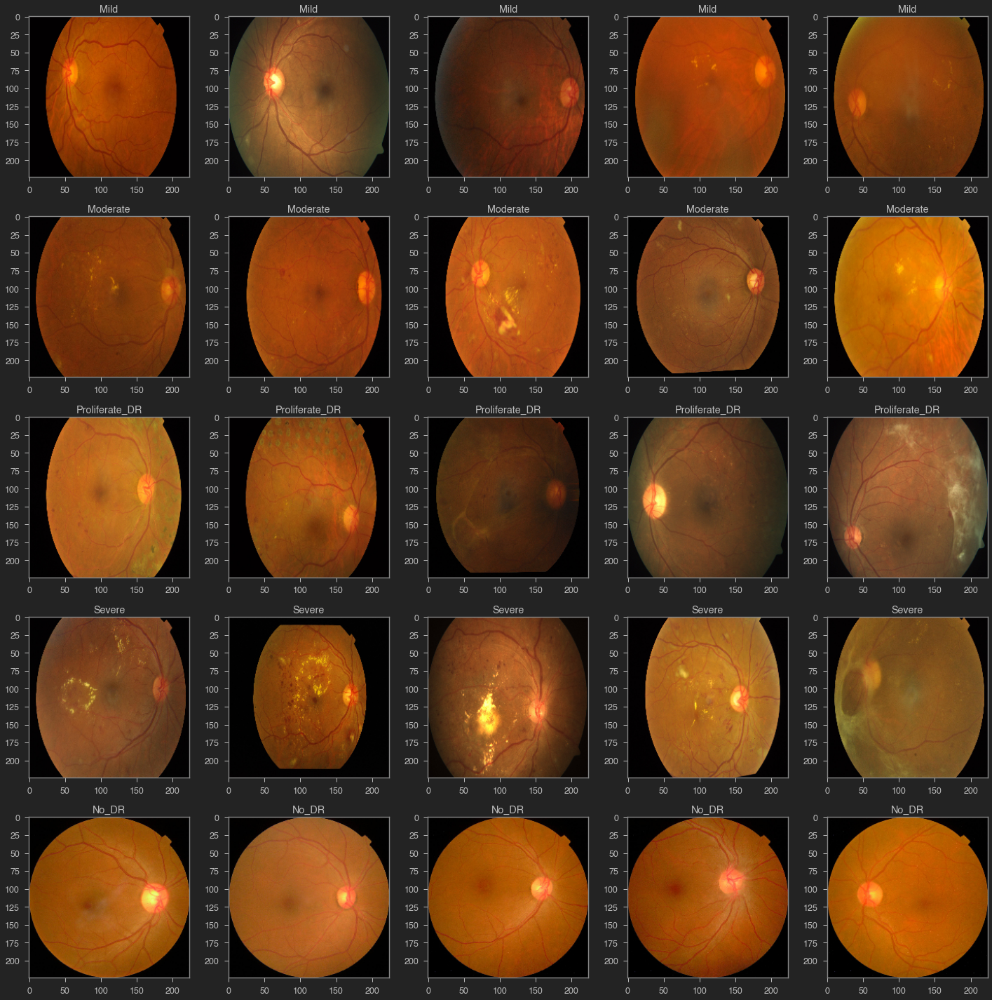
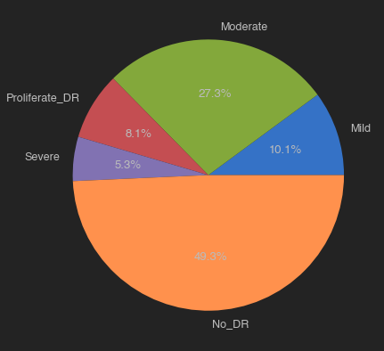
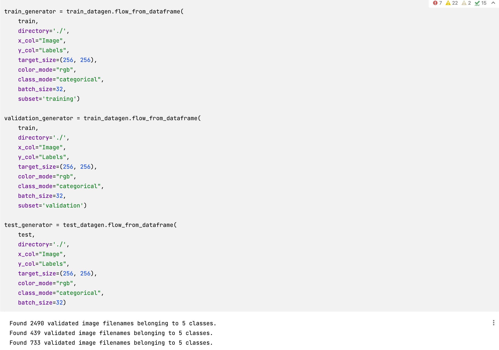
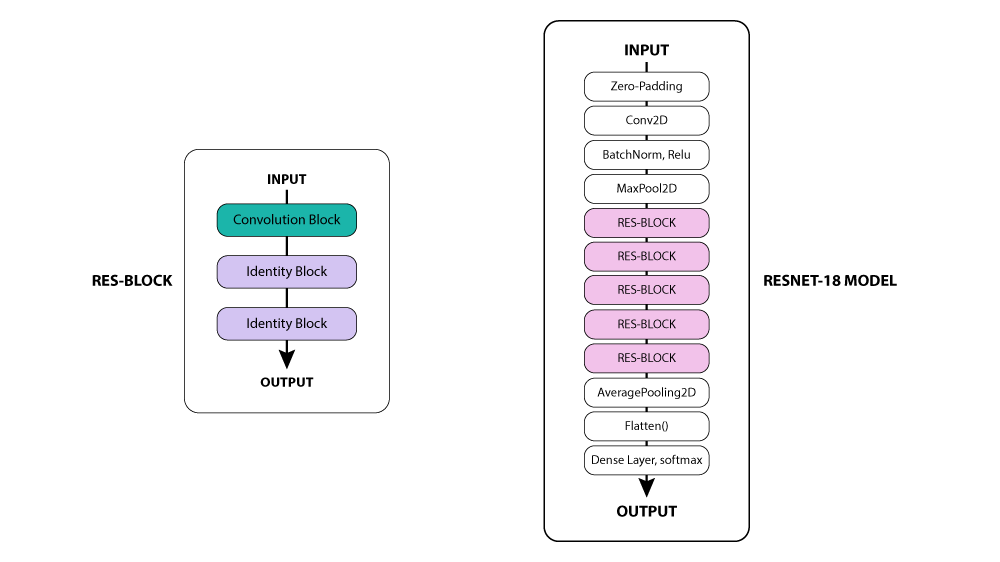
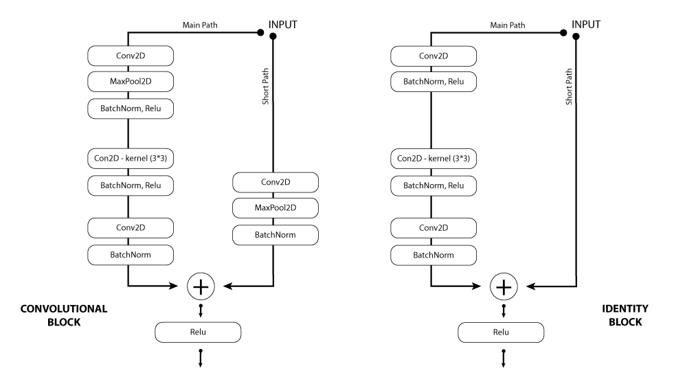

# Diabetic Retinopathy Detection Using Artificial Intelligence
Using Artificial Intelligence to detect Diabetic retinopathy - the leading cause of blindness in the working-age
population of the developed world. It is estimated to affect over 93 million people.

## Objectives:

- Understand the theory and intuition behind Deep Neural Networks, Residual Nets, and Convolutional Neural Networks (CNNs).
- Apply Python libraries to import, pre-process and visualize images.
- Perform data augmentation to improve model generalization capability.
- Build a deep learning model based on Convolutional Neural Network and Residual blocks using Keras with Tensorflow 2.0 as a backend.
- Compile and fit Deep Learning model to training data.
- Assess the performance of trained CNN and ensure its generalization using various KPIs such as accuracy, precision and recall.

## Structure:

### Task #1: Understand the Problem Statement and Business Case
#### Business Case:
- Diabetic Retinopathy is a disease that results from complications of type 1 & 2 diabetes and affects patient eyes.
- The disease can develop if blood sugar levels are left uncontrolled for a prolonged period of time,
- It is caused by the damage of blood vessels in the retina which is located in the back of patient's eyes (retina is light sensitive tissue in the eye).
- Diabetic Retinopathy is the leading cause of blindness in the working-age population of the developed world.
- The World Health Organization estimates that 347 million people have the disease worldwide.
- With the power of Artificial Intelligence and Deep Learning, doctors will be able to detect blindness before it occurs. Aravind Eye Hospital in India hopes to detect and prevent diabetic Retinopathy among people mostly living in rural areas where medical screening and experienced doctors are limited.

|    NO DR | MILD | MODERATE | SEVERE | PROLIFERATE    |
|-----|-----|-----|-----|-----|
|     |     |     |     |     |

#### Inputs and Outputs
- The dataset consists of 3553 color images belongs to 5 categoriess
- Categories that are present in the data are No_DR, Mild, Moderate, Severe and Proliferative (radpily growing)

### Task #2: Import Libraries and Datasets

#### Libraries:

- **pandas**:  dataframe manipulation
- **numpy**: numeric analysis
- **matplotlib, seaborn, plotly**: data visualization
- **sklearn**: split, shuffle data
- **tensorflow**: build, train, deploy AI model
- **keras**: one of the leading high-level neural networks APIs.

#### Datasets:

- There are 3662 sample images in the dataset belong to 5 different labels of Diabetic retinopathy

- train & label are the 2 list of data containing the name of each file and the label of each file accordingly

### Task #3: Perform Data Exploration and Visualization

* Visualize 5 images for each class in the dataset

  

    * Number of images in Mild = 370
    * Number of images in Moderate = 999
    * Number of images in Proliferate_DR = 295
    * Number of images in Severe = 193
    * Number of images in No_DR = 1805

  

### Task #4: Perform Data Augmentation and Create Data Generator

1. Change the order of the data and split it into training and testing: 80% for training and 20% for testing

> retina_df = shuffle(retina_df)
train, test = train_test_split(retina_df, test_size = 0.2,random_state=68)

2. Using ImageDataGenerator for data argumentation
    * Create run-time augmentation on training and test dataset
    * For training datagenerator, we add normalization, shear angle, zooming range and horizontal flip

> train_datagen = ImageDataGenerator( 
rescale = 1./255, 
shear_range = 0.2, 
validation_split = 0.15)

* For test datagenerator, we only normalize the data.

> test_datagen = ImageDataGenerator(rescale = 1./255)

3. Creating datagenerator for training, validation and test dataset.
    * Three different categories
        * 2490 images for training belonging to 5 classes
        * 349 images for validating belonging to 5 classes
        * 733 images for testing belonging to 5 classes

### Task #5: Understand the Theory and Intuition Behind Convolutional Neural Networks

#### Convolutional Neural Networks

Convolutional Neural network compiles different layers before making a prediction. A neural network has:

1. A convolutional layer
2. Relu Activation function
3. Pooling layer
4. Densely connected layer

* The convolutional layers apply different filters on a subregion of the picture.
* The Relu activation function adds non-linearity.
* The pooling layers reduce the dimensionality of the features maps.
* All these layers extract essential information from the images. At last, the features map is feed to a primary fully
  connected layer with a SoftMax function to make a prediction.

### Task #6: Build a ResNet Deep Neural Network Model

### Task #7: Compile and Train the Deep Neural Network Model

### Task #8: Assess the Performance of the Trained Model